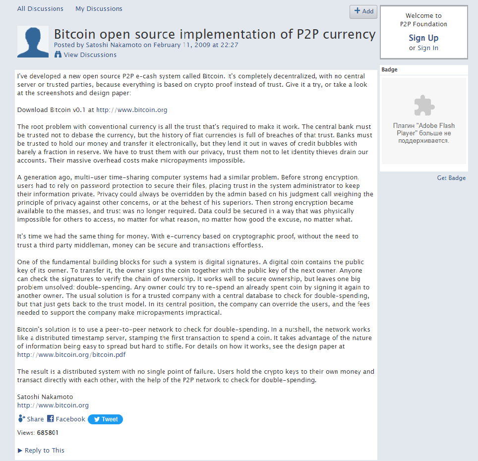
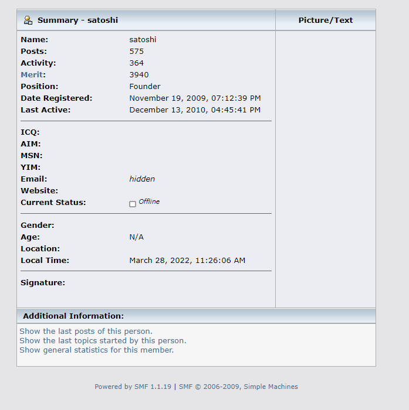
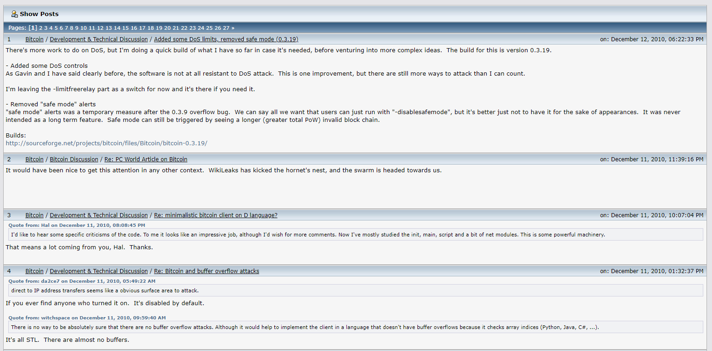
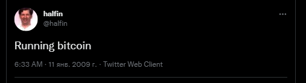
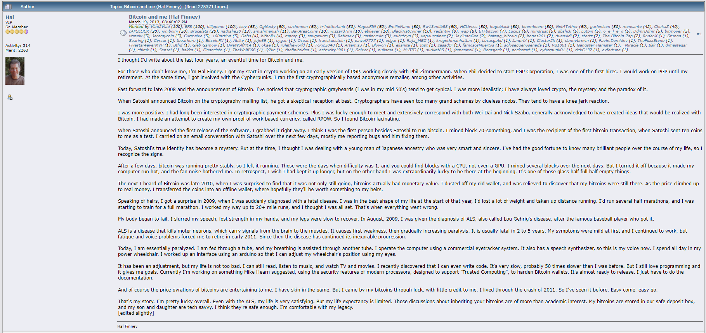

Strange moments in the history of the Satoshi Nakamoto  
---
__In this note I want to notice some points in the history of bitcoin that are not obvious and they are not paid attention to in large articles.__  
__I will not speculate who Satoshi Nakamoto is.__  
  
_I will only ask questions that have arisen in the process of studying the  history of bitcoin and for which I have not found answers.  
I may be wrong and inaccurate. Unfortunately, I have no one to talk to about this.  
Maybe in the future it will help someone in learning the history of bitcoin._  
For convenience, I will use [blockchain.com](https://www.blockchain.com/explorer) as blockchain explorer, you can use any convenient for you, for example, [blockchair.com](https://blockchair.com/bitcoin).  
***
So, I want to pay attention to the initial moments of the launch of bitcoin.  
__Bitcoin chronology:__  

>31.10.2008 - Bitcoin [Whitepaper](https://bitcoin.org/bitcoin.pdf) by Satoshi Nakamoto.  
>03.01.2009 - Launch of the [first Bitcoin block](https://www.blockchain.com/btc/tx/4a5e1e4baab89f3a32518a88c31bc87f618f76673e2cc77ab2127b7afdeda33b), commonly referred to as the [Genesis block](https://www.blockchain.com/btc/tx/4a5e1e4baab89f3a32518a88c31bc87f618f76673e2cc77ab2127b7afdeda33b).  
>12.01.2009 - The first ever [Bitcoin transaction](https://www.blockchain.com/btc/tx/f4184fc596403b9d638783cf57adfe4c75c605f6356fbc91338530e9831e9e16).  
  
But back to Satoshi.  
As far as I could find, Satoshi talked on 3 forums:  
>some first [bitcoin forum](http://bitcoin.sourceforge.net/boards/index.php) which is now closed.  
>[bitcointalk.org](https://bitcointalk.org/index.php?action=profile;u=3) - the main forum where Satoshi communicated.  
>[p2pfoundation.com](http://p2pfoundation.ning.com/profile/SatoshiNakamoto).  
  
_Also use [satoshi.nakamotoinstitute.org](https://satoshi.nakamotoinstitute.org) - this community has tried to collect all the messages that Satoshi has ever left on the internet._  
  
Some [first bitcoin forum](http://bitcoin.sourceforge.net/boards/index.php):  
  
>I tried to find a copy of it in the WebArchive, but without success.  
Perhaps someone has his cast, and you can somehow find it and find out the first messages of Satoshi.  
I learned the information that this is an old forum only from Satoshi himself on the new forum:  
  
  
[P2PFoundation](http://p2pfoundation.ning.com/profile/SatoshiNakamoto):
  
>Satoshi has only 3 posts on this forum.  
>It was this account that was hacked in 2014 and now bad people [sometimes write something on his behalf, trying to earn extra money](http://p2pfoundation.ning.com/forum/topics/bitcoin-open-source?commentId=2003008%3AComment%3A52186).
  
  
[Bitcointalk.org](https://bitcointalk.org/index.php?action=profile;u=3):  
>Satoshi has 575 posts in this forum.  
The [account](https://bitcointalk.org/index.php?action=profile;u=3) on this forum has not been hacked yet.  
  
  
>Also I didn`t find the so-called "farewell" Satoshi message.  
His latest forum posts show that he continued to work.  
So Satoshi just suddenly disappeared without telling anyone?  
  
  
So, another important figure in our history is [Hal Finney](https://en.wikipedia.org/wiki/Hal_Finney_(computer_scientist)).  
>Today, with a very high degree of probability, one can be sure that Hal Finney is the first in history, after Satoshi Nakamoto, user and miner of bitcoin.  
  
I learned about this man from the [podcast with Vitalik Buterin](https://www.youtube.com/watch?v=3x1b_S6Qp2Q&t=284s).  
  
>Absolute proof that Hal Finney was the first bitcoin user we learn [from him](https://twitter.com/halfin/status/1110302988?ref_src=twsrc%5Etfw):  
  
  
_But from here I have a question to which I did not find an answer. As we know, the first transaction in bitcoin was 12.01.2009_.  
__Why is the difference between the first ever [tweet](https://twitter.com/halfin/status/1110302988?ref_src=twsrc%5Etfw) about bitcoin and the first ever [transaction](https://www.blockchain.com/btc/tx/f4184fc596403b9d638783cf57adfe4c75c605f6356fbc91338530e9831e9e16) in bitcoin exactly 1 day?__   
Why did they make the transaction exactly 1 day later? What were they discussing at that moment? For some reason I'm interested.  
  
>So, also from the story of [Hal himself](https://bitcointalk.org/index.php?topic=155054.msg1643833#msg1643833 ), we learn that he communicated with Satoshi by email, where they mainly communicated about technical problems.  
Also, if he is to be trusted, he had been a miner since around 70-th block.  
  
  
__Can Satoshi be alive?__   
>We can't know for sure  
  
__Then why am I asking this question?__  
>Because there is something to cling to.  
According to one [forum user](https://bitcointalk.org/index.php?topic=175996.0), Satoshi had been mining non-stop for a little over a year.  
20.05.2020 a strange [transaction](https://www.blockchain.com/btc/address/17XiVVooLcdCUCMf9s4t4jTExacxwFS5uh?page=7) occurred - funds that were mined in [09.02.2009](https://www.blockchain.com/btc/tx/f38d6f043c070ce9805ee81f46db4d32d0c9f148d62bbfbc0378bc5847c7dc70) and never moved were sent to 2 different addresses.  
At that time, the block reward was 50 BTC.  
If you look further in the explorer, he simply sent 40 btc to another address, and sent 10 btc to the bitcoin mixer. Looks like he just wanted to take them out.  
Of course, it could not be Satoshi, but one of the very first miners.
But the very fact of this event amazes me. 
  
---
I decided that these interesting facts can help someone when studying the history of bitcoin.  
_This page will someday be updated and supplemented with new facts...maybe_